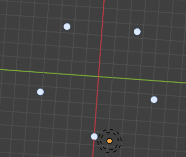
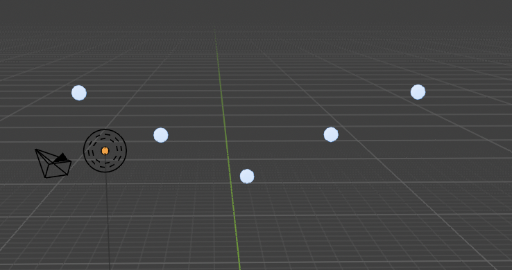
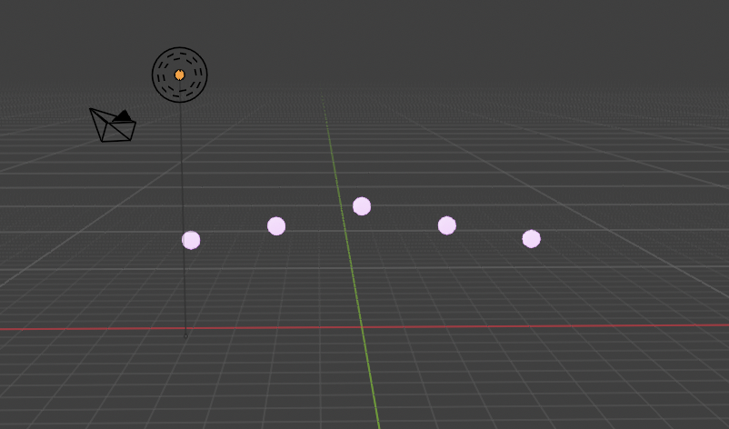

# Blender Drone Show

Simple drone show simulation made in Blender using Python.

## What it does

* Takeoff
* Circle formation
* Circle rotation
* V formation
* Color change
* Landing

## Technologies

* Blender
* Python
* bpy

Simulation

Circle Formation

V Formation

Landing
